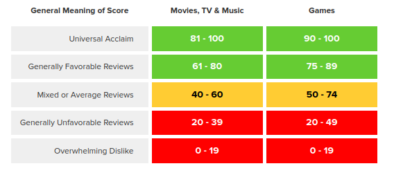
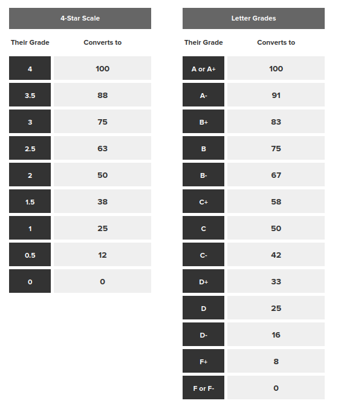

```{r setup, include=FALSE}
knitr::opts_chunk$set(echo = TRUE)
```

---

# Préambule

Notre étude se base sur un dataset scrappé par Rush Kirubi (lien: https://www.kaggle.com/datasets/rush4ratio/video-game-sales-with-ratings).
Qui lui même a repris le dataset de Gregory Smith en le mettant à jour (lien: https://www.kaggle.com/datasets/gregorut/videogamesales)

---

# Introduction

## Contexte

Metacritic est un site web américain lancé en 2001. Il s'occupe d'agréger les avis et les notes, provenant de la presse américaine, sur les domaines des films, shows télévisés, albums musicaux, jeux vidéos et livres, et cela dans le but d'aider les utilisateurs à choisir les meilleurs contenus pour dépenser leur temps et leur argent.
Le site offre aussi la possibilité aux utilisateurs de voter. Mais ces derniers ne sont pas pris en compte dans la note générale.

On ne s'intéressera ici qu'au domaine des jeux vidéo. De ce fait, une notion importante transparaît : avant 2020, il était possible pour les utilisateurs de voter pour un jeu avant qu'il ne soit réellement sorti, si la plateforme avait inclus sa page sur le site.
Les campagnes récentes de "review-bombing", qui signifie qu'un nombre important d'utilisateurs se regroupent pour laisser une mauvaise note sur un jeu afin de ternir son image ou celle de son éditeur (souvent pour punir le studio de production pour des choix idéologiques pris ou des problèmes internes), ont poussé le site à changer de politique.
Aujourd'hui, les utilisateurs ne peuvent voter que 36 heures après la sortie officielle du jeu, alors même que les notes provenant de la presse sont déjà sorties.

Le site possède une liste de sites de presse, triés par type de contenu réévalué chaque année, une liste de sites sur lesquels ils extraient les notes et reviews.
Il faut au minimum 4 reviews différentes pour qu'un metascore soit produit.
Les metascore est la note "officielle" donnée à un jeu, cette note pouvant aller de 0 à 100. Regroupées par intervalles auxquels on associe une couleur comme l'illustre la figure 1 ci-dessous
 
  
 
<b> Figure 1 : Tableau des signification des différents metascores </b> 

La note non-officielle provenant des utilisateurs s'échelonne quant à elle sur une échelle de 0 à 10.
Un metascore de 81 et plus se voit attribuer la mention "Must-See". Et, d'après la FAQ du site, environ 5% des films ont cette mention.
Le processus d'ajout de reviews est permanent. La note est donc sujette à évoluer. Toutefois, seule la première note publiée et récupérée d'une presse est ajoutée. Elle ne sera pas mise à jour si cette dernière la change après.

L'algorithme de notation de Metacritic ne tolérant que des nombres de 0 à 100, dans le cas où l'organe de presse publie une notation lettrée (A+,A, A-, B+,...), des étoiles (sur 5 par exemple), d'autres types de graduation, voire même seulement du texte (dans le cadre de reviews de film ou de livre par exemple), des conventions ont été mise en place pour permettre leur conversions de manière systématique (image 2).

  

<b> Figure 2 : Tableau de conversion des notes lettrées et notes étoilées en notes de 0 à 100 </b>

Terminons cette mise en contexte par une notion majeure à prendre en compte. Le metascore est une moyenne pondérée. En fonction de la qualité d'une review et du statut général de sa provenance, une critique aura un poids plus ou moins important dans la moyenne. Cette pondération n'est pas publique et est déterminée uniquement par la direction du site.
 
---

## But du dataset

L'auteur du dataset se nomme Rush Kirubi. Il a travaillé en tant que Data Scientist dans trois services de l'entreprise Verisk, située dans le Massachussets aux Etats Unis d'Amérique.
Il possède des certifications sur la Data Science et le langage R.

Concernant son jeu de données, il a écrit qu'il aimerait voir ce que d'autres individus pourraient mettre en œuvre, grâce à des techniques de machine learning ou des méthodes de visualisation continue, en lien avec un domaine qu'il affectionne : le domaine du jeu vidéo.

Egalement, il explique qu'il a été motivé par un autre dataset scrappé avec Python par Gregory Smith, intitulé "Video Game Sales", basé sur le site VGChartz qui est un site de suivi des ventes de jeux vidéo, fournissant des chiffres de vente hebdomadaires de logiciels, de matériels, et de console par région. Cet ensemble de données contient une liste de jeux vidéo dont les ventes sont supérieures à 100 000 exemplaires.

Rush Kirubi a fusionné le travail de Gregory Smith avec une extension, générée elle aussi par scrapping Python et a notamment ajouté le nombre et la moyenne des notations des utilisateurs et celles de Metacritic. Cependant, il y a des observations manquantes car Metacritic ne couvre pas toutes les plateformes effectivement couvertes par VGChartz.

Nous considérons qu'il y a par conséquent deux auteurs de ce dataset, et ils imposent que, si une ou plusieurs personnes se servent de leurs jeux de données, ils soient cités et référencés par un lien redirigeant leurs travaux.

Ce jeu de données fusionné prend pour cible les notes attribuées par les joueurs et Métacritic, ainsi que les ventes effectuées sur divers jeux vidéo, venant de plateformes différentes et produits par des éditeurs variés et référencent les caractéristiques générales de jeux vidéos : nom, genre, année de sortie, développeurs notamment. Les données ont été récoltées il y a 6 ans.  

Le dataset contient des informations sur les ventes de jeux vidéo et leurs notes entre 1985 et 2016. Il possède 16 colonnes :

  - <b>Name</b>, de type chr :
  	- contient les noms des jeux, par exemple "Tetris".
  - <b>Platform</b>, de type chr :
  	- contient les consoles, par exemple : "NES", "Wii", "GB", "X360", GBA", "PS4", "3DS", "N64", "XOne", "PC", "PS", "2600", "PSP", etc.
  - <b>Year_of_Release</b>, de type chr :
  	- contient les années de sortie des jeux de 1985 à 2016.
  - <b>Genre</b>, de type chr :
  	- contient le genre du jeu, par exemple : "Simulation", "Action", "Sports", "Shooter", "Platform", "Puzzle", "Role-Playing", "Adventure", etc.
  - <b>Publisher</b>, de type chr :
  	- contient l'éditeur du jeu, par exemple : "Take-Two Interactive", "Ubisoft", "Bethesda Softworks", "Activision", "Electronic Arts", etc.
  - <b>NA_Sales</b>, de type dbl :
  	- contient les ventes effectuées en Amérique du Nord, en millions de copies vendues,
  - <b>EU_Sales</b>, de type dbl :
  	- contient les ventes effectuées en Europe, en millions de copies vendues,
  - <b>JP_Sales</b>, de type dbl :
  	- contient les ventes effectuées au Japon, en millions de copies vendues,
  - <b>Other_Sales</b>, de type dbl :
  	- contient les ventes effectuées dans le reste du monde, en millions de copies vendues,
  - <b>Global_Sales</b>, de type dbl :
  	- contient les ventes totales effectuées dans le monde, en millions de copies vendues,
  - <b>Critic_Score</b>, de type dbl :
  	- contient le score donné par Metacritic, de 0 à 100,
  - <b>Critic_Count</b>, de type dbl :
  	- contient le nombre de critiques prises en compte dans le score donné par Metacritic
  - <b>User_Score</b>, de type chr :
  	- contient le score donné par les utilisateurs tous pays confondus, sur Metacritic, de 0 à 10,
  - <b>User_Count</b>, de type dbl :
  	- contient le nombre de notes données par les utilisateurs, sur Metacritic,
  - <b>Developer</b>, de type chr :
  	- contient le studio de développement du jeu, par exemple : "Bethesda Games Studios", "Rocksteady Studios", "Nintendo", "Konami", "Square Enix", etc.
  - <b>Rating</b>, de type chr :
  	- contient le rang ESRB, par exemple : "E", "M", "T", "E10+", "K-A", etc.  
 
Il met à disposition plus de 16500 données dont environ 6900 sont des données complètes incluant les ventes et les notes.
 
Le dataset contient 3 catégories de données :

  1. Les informations sur le jeu : son nom, son année de sortie, son éditeur, son genre et la classification ESRB ;
 
Les classifications ESRB fournissent des informations sur ce qu'il y a dans un jeu ou une application afin que les parents et les consommateurs puissent faire des choix éclairés sur les jeux qui conviennent à leur famille. (Tous, Adolescents, Adultes seulement, etc.)

  2. Le nombre d’unités vendues par région : Japon, Amérique du Nord, Europe, mondial et autre ;
 
  3. Les critiques : divisées en deux types, les critiques utilisateur et le score des critiques, déterminé en faisant la moyenne des critiques de différents professionnels, ainsi que leur décompte.

On distingue les variables quantitatives, les ventes dans les divers pays / continents mentionnés plus haut, des variables qualitatives, telles que les scores attribués par Metacritic et les utilisateurs.

Aussi, concernant les notes attribuées par les utilisateurs, c'est-à-dire la colonne User_Score, nous avons constaté que non seulement le type chr ne correspond pas à la nature numérique de la donnée, mais également qu'elle n'est pas sur la même intervalle (ici [0 ; 10]) que les scores donnés par Metacritic, soit la colonne Critic_Score, qui est de type dbl, et sur l'intervalle [0 ; 100].

---

## Description de la question
 
C'est durant l'âge d'or des jeux vidéos (1974-1984) que l'on a vu naître les premiers magazines de presse consacrés à cette industrie. Il a fallu attendre 7 ans pour que naisse le premier magazine à être uniquement consacré aux jeux vidéo (Computer and Video Games, Royaume-Uni).

Jusqu'à l'avènement d'internet, ces magazines représentaient presque le seul moyen de s'informer et notamment, de permettre aux utilisateurs d'orienter leurs achats vers les meilleurs jeux grâce aux tests notés, que l'on pouvait retrouver dedans. Les parutions mensuelles permettaient à la rédaction de prendre le temps de finir un jeu, de l'explorer sérieusement afin d'en produire une review, considérée généralement comme étant de bonne qualité.

L'arrivée d'internet et notamment des réseaux sociaux (Facebook en 2004) amena avec elle l'ère de l'information en temps réel accessible à tous. Cela imposa une énorme pression qui entraîna une crise structurelle de la presse. Avec elle, une difficulté grandissante à trouver des financements ajouté à une lutte farouche pour l'obtention d'informations.
En effet, Il est maintenant très facile pour les utilisateurs de partager leurs avis et de les consulter, court-circuitant ainsi ceux de personnes dont c'est le métier.

C'est depuis cette époque qu'une grande majorité de joueurs ont constaté des différences généralisés de notations entre presse spécialisé et utilisateurs, notamment sur les jeux noté AAA, c'est à dire des jeux provenant souvent des plus gros éditeurs car bénéficiant d'un budget très élevé (compter en million/ dizaine de million voir plus).

Il est généralement admis dans le monde des joueurs, qu'afin de survivre, les acteurs de la presse vidéoludique sur-noterait les jeux des gros éditeurs en échange d'argent, d'accès à des évènements privés ou encore de partenariat pour bénéficier d'information en avant première.

Mais qu'en est-il réellement? Y a-t-il eu réellement un changement des différences entre les notes de la presse et des utilisateurs au cours du temps? Et si c'est le cas, ce changement est-il supérieur chez les jeux publiés par les gros éditeurs?


# Methodologie


```{r}
# Librairies utilisées dans cette étude
library(tidyverse)
library(patchwork)
library(cowplot)
library(ggplot2)
library(ggthemes)
library(forcats)
options(dplyr.summarise.inform = FALSE)
```

---

## Procédure de nettoyage des données

Il y a plusieurs points problématiques dans ce jeu de données brutes qui nous obligent à effectuer un travail de préparation en amont avant de pouvoir les utiliser.

Tout d'abord, nous avons changé le type de 4 des 16 variables qui composent ce dataset. A savoir:
  
  - La colonne Year_of_Release anciennement référencée comme un caractère, est transtypée en tant qu'entier.
  - Les colonnes Critic_Count et User_Count anciennement référencées en tant que nombre à virgule, sont également transtypées en tant qu'entier
  - Enfin, sûrement la chose la plus importante en termes de typage pour notre étude, la colonne User_Score qui était définie comme un caractère sera transtypée en tant que nombre à virgule

```{r}
# Le jeux de données après re-typage des colonnes
# Supprimer l'attribut col_type="cciccddddddidicc" ci-dessous pour observer le typage brute des données
data <- read_delim("./csv/Video_Games_Sales_as_at_22_Dec_2016.csv",delim=",", col_type="cciccddddddidicc")
# Décommenter la ligne du dessous pour observer le dataset après re-typage
#head(data)
```
Ensuite, nos données ne sont pas au format tidy ‘long’.

En effet, on constate par exemple que les 5 colonnes Critic_Score, Critic_Count, User_Score et User_Count, qui sont celles qui nous interessent ici, ne représentent que 3 variables différentes, à savoir:
  - les scores,
  - le nombre de votant,
  - et le type de votant (critic ou user).
 
On a donc ajouté une colonne Origin_of_the_Score qui discrimine les colonnes Score et Count par leur provenance ('User' ou 'Critic').

Il est important de noter que les 5 colonnes représentant les ventes d'un jeu par rapport à certains continents ne sont également pas au format tidy ‘long’.

Hors, comme nous ne nous intéressons pas à ces données dans le cadre de notre étude, même si nous utiliserons la colonne des ventes totales Global_Sales afin de déterminer les plus gros éditeurs de notre dataset, nous ne prenons pas le temps de les reformer au début, car nous ne les ferons pas apparaître dans le jeu de données après mise en forme.

De plus, seuls les jeux ayant à la fois un score provenant de la presse et des utilisateurs nous intéressent, pour pouvoir en faire une comparaison. On élimine donc tous les jeux n'ayant pas à la fois une valeur pour ces deux colonnes.

Certains des jeux sont enregistrés sans leur année de sortie, ce qui est problématique ici car c'est un critère de comparaison que nous allons utiliser. On enlève donc en plus les jeux n'ayant pas de date de sortie.

Enfin, on a choisi d'écarter les jeux sortis avant 1996. En effet, bien que 707 jeux sortis avant cette date soient enregistrés dans la base de données, seulement 4 disposent à la fois d'une note provenant des utilisateurs et de la presse.

Au regard de la figure 3, on comprend que la moyenne est faite sur un seul jeu pour les 4 paires de points avant 1996. Le fait qu'elles soient sporadiques est aussi rentré en compte dans notre choix de les écarter.

```{r}
# On filtre les données pour n'avoir que des lignes dont les scores (utilisateurs et critiques) et l'année de sortie ne sont pas vide. Et dont l'année de sortie du jeu est strictement supérieur à 1995
data_filter <- data %>% filter(!is.na(User_Score) & !is.na(Critic_Score) & !is.na(Year_of_Release) & Year_of_Release > 1995 )

# Travaille en 2 temps pour mettre les colonnes User_Score, User_Count, Critic_Score, Critic_Count au format dtidy

# On créer une table qui regroupe les scores et count des utilisateurs en rajoutant la colonne discriminante Origin_of_the_Score
UserData <- data_filter %>% 
  select(Name, Platform, Year_of_Release, Genre, Publisher, Developer, Rating, User_Score, User_Count, Global_Sales) %>%
  mutate(Origin_of_the_Score = 'User') %>%
  rename(
    Score = User_Score,
    Count = User_Count
  ) %>%
  mutate(User_Score_Tmp = Score * 10) %>%
  select(-Score) %>%
  rename(Score = User_Score_Tmp)

# On créer une table qui regroupe les scores et count des critiques en rajoutant la colonne discriminante Origin_of_the_Score
CriticData <- data_filter %>% 
  select(Name, Platform, Year_of_Release, Genre, Publisher, Developer, Rating, Critic_Score, Critic_Count, Global_Sales) %>%
  mutate(Origin_of_the_Score = 'Critic') %>%
  rename(
    Score = Critic_Score,
    Count = Critic_Count
  )

# Ajout d'une colonne qui contient la différence entre les scores des critiques - celles des utilisateurs. Nous servira plus tard pour le tracer de graphes.
UserData$diff_Score = CriticData$Score - UserData$Score
CriticData$diff_Score = CriticData$Score - UserData$Score

data_tidy <- full_join(UserData, CriticData)

# Décommenter pour obtenir le nombre distinct de jeu dans le jeu de données brute
#data %>% nrow()
# Décommenter pour obtenir le nombre distinct de jeu dans le jeu de données après mise en forme
#data_tidy %>% filter(Origin_of_the_Score == 'User') %>% nrow()
# Décommenter pour observer le jeu de données après mise en forme
#head(data_tidy)

# Nombre de jeux dans notre database épuré dont on dispose à la fois des notes utilisateurs et de la critique
#data_tidy %>% filter(Origin_of_the_Score == 'User' & Year_of_Release < 1996) %>% nrow()
# Nombre de jeux total de la database enregistrés sortie avant 1996
#data %>% filter(Year_of_Release < 1996) %>% nrow()
```

	
À la fin de notre processus de mise en forme, nous sommes passés d'un jeu de données contenant 16719 jeux distincts à seulement 6890 utilisables et au format tidy.
L'intervalle de temps de nos données s'échelonne quant à lui sur une période de 20 ans, de 1996 à 2016.
Ceci fait, nous allons maintenant pouvoir commencer à les exploiter.

---

## Exploration du dataset

Le point de départ de notre étude vise à observer nos données d'un point de vue global.
Nous allons nous intéresser aux différences entre les notes moyennes par an données par la presse critique par rapport à celle des utilisateurs.


```{r}
moy_Score <- data_tidy %>% select(Score, Year_of_Release, Origin_of_the_Score) %>%
  group_by(Year_of_Release, Origin_of_the_Score) %>% 
  summarise(Mean = mean(Score))


#head(moy_Score)

depart <- ggplot(moy_Score, aes(x = Year_of_Release, y = Mean)) +
  ylab(label = "note moyenne") +
  xlab(label = "année de sortie") +
  geom_point( size = 2 ) +
  theme_bw() +
  geom_line() +
  geom_vline(xintercept=2010, linetype="dashed", color = "brown") +
  aes(col = fct_rev(`Origin_of_the_Score`)) +
  scale_color_manual(values = c("#4b0082","#cc6600")) +
  labs(title= "Notes moyennes par an données aux jeux vidéo",
       subtitle = "Comparaison entre les consommateurs et la presse au niveau mondial",
       caption = "Data source : Kaggle scrapped from Metracritic",
       col = "Évaluateur") +
  ylim(c(0, 100)) +
  theme(plot.title = element_text(color = "#063376", hjust = 0, size = 20),
        plot.subtitle = element_text(color = "#063394", size = 15),
        axis.line.y = element_line(colour = "black", size = 1),
        panel.grid.major = element_blank(), 
        panel.grid.minor = element_blank()) 

depart

```

<b> Figure 3 : Graphique des notes moyennes par an données au jeux vidéos au niveau mondial </b>

Ce graphique vise à avoir un point de vue global sur les données dans le cadre de notre question de départ, pour nous orienter vers une stratégie d'analyse plus précise et pertinente par la suite.

Cette visualisation des données montre les notes moyennes sur tous les jeux sans distinction, données par les utilisateurs.
Le choix des couleurs est basé sur la roue chromatique, pour ne pas utiliser les couleurs complémentaires "rouge" et "vert" qui peuvent donner l'illusion de "mal" et "bien" nous avons opté pour les couleurs complémentaires miroir au rouge et au vert. Le "jaune orangé" et le "bleu violacé".
Ce choix permet une combinaison très contrastée entre les deux courbes qui s'opposent.
Ce qui nous apparaît clair en premier lieu, c'est qu'il semble y avoir une corrélation entre les moyennes des utilisateurs et de la presse.

Il y a une cassure de la continuité entre 1999 et 2000.

Il y a quelques fluctuations mais elles ne sont pas très significatives : avant 1999 les notes moyennes des jeux se trouvaient autour de 84/100, après cela elles sont plutôt autour de 71/100. Ce n'est cependant pas à exclure, car cela pourrait traduire une baisse dans la qualité des jeux sortis après 1999, ou bien des votes par effet de nostalgie, par exemple.

Nous pouvons constater par 2 fois, en 1997 et en 2010, le croisement des valeurs avant l'inversement de la tendance.

Avant 1997, la presse notait en moyenne légèrement mieux, en revanche, entre 1998 et 2008, soit une période de 10 ans, c'était plutôt les utilisateurs. Après 2010 la presse est de nouveau repassée devant.

Un indicateur intéressant qui ne saute pas forcément aux yeux est que l'écart-type entre les différences des notes de nos 2 sources est de 13.

Ce qui, au regard d'un score, reste une différence non négligeable. En effet, sur une échelle de 100, cela représente une variation de plus de 10%, qui fait facilement passer un jeu d'une catégorie à une autre.


```{r}
# Partie permettant de calculer des indicateurs de tendance du diagramme
# moyenne et écart-type des moyennes par an des différences entre les scores des critics et ceux des users
data_tidy %>% 
  filter(Origin_of_the_Score == 'User') %>%
  summarise(
    moyenne_user = mean(diff_Score),
    ecart_type_user = sd(diff_Score))

# moyenne et écart-type des scores et du nombre de votants pour les users
data_tidy %>% 
  filter(Origin_of_the_Score == 'User') %>%
  summarise(
    moyenne_score_user = mean(Score),
    ecart_type_score_user = sd(Score),
    moyenne_count_user = mean(Count),
    ecart_type_count_user = sd(Count))

# moyenne et écart-type des scores et du nombre de note pour les critics
data_tidy %>% 
  filter(Origin_of_the_Score == 'Critic') %>%
  summarise(
    moyenne_score_critic = mean(Score),
    ecart_type_score_critic = sd(Score),
    moyenne_count_critic = mean(Count),
    ecart_type_count_critic = sd(Count))


# moyenne des scores de la presse et des utilisateurs avant 1999 (inclus)
data_tidy %>% 
  filter(Year_of_Release <= 1999) %>%
  summarise(
    moyenne_score = mean(Score))
# moyenne des scores de la presse et des utilisateurs après 1999 (exclus)
data_tidy %>% 
  filter(Year_of_Release > 1999) %>%
  summarise(
    moyenne_score = mean(Score))
```

On pourrait donc estimer ici qu'au regard de ce graphique, rien ne laisse penser que la presse surnoterait les jeux des gros éditeurs, notamment les grosses licences.

Toutefois, la courbe associée aux critiques repassant au-dessus de celle des utilisateurs à partir de 2010 pose 2 questions.

Est-ce une tendance qui s'est prolongée sur les années qui ont suivi 2010 ? Ou alors, est-ce que les courbes ont plutôt suivi un schéma similaire aux années précédentes ?
Nous ne répondrons pas à ces questions ici, n'ayant pas les données, ni les niveaux d'analyse et de maîtrise suffisants pour faire des prévisions.

Nous allons plutôt tenter d'approfondir l'analyse du dataset, pour confirmer ou infirmer notre postulat de base, et voir dans quels cas les notes de la presse pourraient avoir effectivement augmenté après 2010 : nous allons nous intéresser à l'évolution des notes par an d'un des plus gros éditeurs de jeux vidéos, Electronic Arts.

Le but de cette observation sera alors de voir si l'on peut remarquer un schéma divergeant en ce qui concerne cet éditeur à partir de 2010.

On entend ici par "gros éditeurs" ceux ayant réalisés les plus grosses ventes. Ce sont aussi ceux qui sont par extension dans les tableaux des entreprises dégageant le plus gros CA et produisant des jeux AAA.


```{r}

data_tidy %>% 
  filter(Origin_of_the_Score == 'User') %>% 
  select(Name, Publisher, Global_Sales) %>% 
  group_by(Publisher) %>% 
  summarise(cumulatedSales = sum(Global_Sales)) %>%  
  arrange(desc(cumulatedSales)) %>% 
  head(n = 6) %>%
  ggplot() +
  theme_bw() +
  aes(x= fct_reorder(Publisher, cumulatedSales)) +
  aes(y= cumulatedSales) +
  aes(fill = Publisher) +
  geom_col() +
  geom_text(aes(label = cumulatedSales), hjust = 1.2) +
  coord_flip() + 
  scale_fill_manual(
    values=c("#003f5c",
             "#444e86",
             "#dd5182",
             "#ff6e54",
             "#955196",
             "#ffa600")) +
  xlab("") +
  scale_y_continuous(breaks = seq(0, 900, 100)) +
  ggtitle("Ventes cumulées pour les 6 plus gros éditeurs de 1995 à 2016") + 
  theme(legend.position = "none",
        plot.title = element_text(size = 15, family = "roboto", hjust = 1),
        axis.text = element_text(size = 10, family = "roboto"),
        panel.grid.major = element_blank(),
        axis.title.y = element_text(size = 10, family = "roboto"),
        panel.grid.minor = element_blank()) +
  ylab("nombre de jeux vendus en millions") +
  labs(caption = "Data source : Kaggle scrapped from Metracritic",
       fill = "") 

```

<b> Figure 4 : Graphique des unitées vendues pour les 6 plus gros éditeurs de 1995 à 2016 </b>

```{r}
moy_Score_Electronic_arts <- data_tidy %>%
  filter(Publisher == 'Electronic Arts') %>%
  group_by(Year_of_Release, Origin_of_the_Score) %>% 
  summarise(Mean = mean(Score))

elec <- moy_Score_Electronic_arts %>% 
  ggplot() + 
  aes(x = Year_of_Release) +
  aes(y = Mean) +
  ylab("moyenne des notes") +
  xlab("année de sortie") +
  geom_point( size = 2) +
  geom_line() +
  aes(col = fct_rev(`Origin_of_the_Score`)) +  
  scale_color_manual(values = c("#4b0082","#cc6600")) +
  labs(title= "Notes moyennes par an données aux jeux de\nl'éditeur Electronic arts",
       subtitle = "Comparaison entre les consommateurs et la presse au niveau mondial",
       caption = "Data source : Kaggle scrapped from Metracritic",
       col = "Evaluateur") + 
  ylim(c(0,100)) +
  theme_light() +
  theme(plot.title = element_text(color = "#063376", hjust = 0, size = 22),
        plot.subtitle = element_text(color = "#063394", size = 15),
        axis.line.y = element_line(colour = "black", size = 1),
        panel.grid.major = element_blank(), 
        panel.grid.minor = element_blank())

elec
```

<b> Figure 5 : Grpahique sur les notes moyennes de la presse et des utilisateurs données aux jeux d'EA entre 1996 et 2016 dans le monde </b> 

Nous avons ensuite choisi d'explorer les données d'un éditeur de jeu vidéo de renom, que l'on sait cependant être controversé, afin d'observer le comportement des courbes dans un cas plus précis et tendancieux.

Ce graphique montre les notes moyennes sur tous les jeux publiés par Electronic Arts, données par les utilisateurs en violet, par rapport à celles données par la presse Metacritic en orange, par année.

Ce cas précis semble confirmer ce que nous avions vu dans le graphique précédent, les notes de la presse seraient meilleures que celles des utilisateurs après 2010.

Nous observons au début du graphique, entre environ 2000 et 2010, que les notes de la presse sont très proches de celles des utilisateurs.

Puis, après 2010, la courbe de la presse augmente très légèrement, en restant la plupart du temps au-dessus de 75 / 100, contrairement à celle des utilisateurs, qui est en baisse, affichant clairement des notes moyennes en dessous de 75 / 100 et atteignant même 50 / 100 en 2015.

Paragraphe on parle de ce qu'on fait ensuite

Étant donné que nous n'avons analysé qu'un seul éditeur de jeux vidéos, que nous avions expressément choisi pour démontrer qu'il pouvait y avoir une différence notable entre l'opinion de la presse et celle des utilisateurs exprimée par les notes, nous décidons de calculer directement les différences de notations entre les utilisateurs et la presse sur les éditeurs les plus connus, ce que nous évaluons à l'aide du nombre d'unités vendues, mais aussi à l'aide de nos connaissances personnelles sur le sujet.

Nous avons donc choisi 9 d'entre eux pour avoir un meilleur panel et pouvoir faire une analyse plus complète, et déterminer à quel point il existe des cas similaires à Electronic Arts parmi les éditeurs les plus célèbres.

Étant donné que nous n'avons analysé qu'un seul éditeur de jeux vidéos, que nous avions expressément choisi pour démontrer qu'il pouvait y avoir une différence notable entre l'opinion de la presse et celle des utilisateurs exprimée par les notes, nous décidons de calculer directement les différences de notations entre les utilisateurs et la presse sur les éditeurs les plus connus, ce que nous évaluons à l'aide du nombre d'unités vendues, mais aussi à l'aide de nos connaissances personnelles sur le sujet.

Nous avons donc choisi 6 d'entre eux pour avoir un meilleur panel et pouvoir faire une analyse plus complète, et déterminer à quel point il existe des cas similaires à Electronic Arts parmi les éditeurs les plus célèbres.


```{r}
head(data_tidy)

diff_editeurs <- data_tidy %>%
  filter(Publisher == 'Electronic Arts' | Publisher == 'Nintendo' | Publisher == 'Activision' | 
         Publisher == 'Sony Computer Entertainment' | Publisher == 'Take-Two Interactive' | 
         Publisher == 'Ubisoft') %>%
  group_by(Year_of_Release, Publisher) %>%
  summarize(avg_diff = mean(diff_Score)) %>%
  ggplot() +
  aes(x=Year_of_Release) +
  aes(y=avg_diff) +
  geom_line(aes(color=Publisher), size=2)  +
  theme_bw() + 
  geom_hline(yintercept = c(13, -13), lty = "dotted") +
  geom_hline(yintercept = c(0), lty = "dashed") +
  theme(legend.position = "none",
        plot.title = element_text(hjust = 0, size= 11.5, face = "bold"),
        plot.subtitle = element_text(hjust = 0),
        axis.text.x = element_text(size = 9, family = "roboto"),
        panel.spacing.x = unit(1, "lines")) +
  facet_wrap(~ Publisher) +
  aes(fill = Publisher) +
  scale_color_manual(
    values=c("#003f5c",
             "#444e86",
             "#dd5182",
             "#ff6e54",
             "#955196",
             "#ffa600"
             )) +
  xlab(label = "année de sortie") +
  ylab(label = "différence moyenne") +
  labs(title = "Différence par an entre les notes de la presse et celles des utilisateurs",
      subtitle = "Données portant sur les 6 plus gros éditeurs pour la période 1995-2016",
      caption = "Data source : Kaggle scrapped from Metracritic",
      fill = "") +
  theme(plot.title = element_text(color = "#063376", hjust = 0, size = 13)) +
  theme(plot.subtitle = element_text(color = "#063394", size = 12)) +
  theme(axis.line.y = element_line(colour = "black", size = 1),
        panel.grid.major = element_blank(), 
        panel.grid.minor = element_blank())

diff_editeurs
```

<b> Figure 6 : Graphique des différences de notations sur les 6 plus gros éditeurs de jeux vidéo </b>

Ce graphique montre les différences de notations entre les utilisateurs et la presse Metacritic sur les éditeurs de jeu vidéos Activision, Electronic Arts, Nintendo, Sony Computer Entertainment, Take-Two Interactive et Ubisoft, tous sélectionnés pour leur renommée et leur popularité auprès des joueurs, afin d'avoir le maximum de données à exploiter et faire ressortir les informations les plus pertinentes possibles.

Pour mieux appréhender le graphique, il faut savoir que :

  - la courbe colorée en fonction de l'éditeur représente la différence moyenne de notation entre la presse et les utilisateurs sur tous ses jeux, au fil des années,
 
  - quand la courbe est située en dessous de 0 cela signifie que les utilisateurs ont mieux noté le jeu que la presse,
  - quand la courbe est située au dessus de 0, cela signifie que la presse a mieux noté le jeu,

  - les lignes en pointillés espacés reflètent l'écart-type entre les notes de tous les jeux,

Nous pouvons constater plusieurs patterns de courbes selon les éditeurs.

La courbe de l'éditeur Nintendo par exemple, étant donné que la courbe ne s'éloigne que très peu de la différence moyenne 0, nous montre que les notes de la presse semblent plutôt fidèles aux notes données par les utilisateurs.

La courbe d'Ubisoft  et celle de Sony Computer Entertainment se rapprochent du cas de Nintendo, dans une moindre mesure.

La courbe de Take-Two Interactive suit un pattern plutôt croissant, ce qui signifie que les utilisateurs notaient mieux les jeux au début que la presse, puis que la tendance s'est inversée aux alentours de 2005.

Les courbes d'Activision et d'Electronic Arts suivent un pattern plus particulier que les autres courbes étudiées précédemment, car même si elles fluctuent, elles sortent clairement de l'écart-type après 2010, la différence de notation entre les utilisateurs et la presse est plus grande que la normale, avoisinant une différence moyenne de 20. La presse noterait alors nettement mieux les jeux que les utilisateurs.

On peut se demander à quoi peut ressembler le diagramme 1 quand on restreint les éditeurs aux 6 plus gros.


```{r}
courbe_editeur <- data_tidy %>% 
  filter(Publisher == 'Electronic Arts' | Publisher == 'Nintendo' | Publisher == 'Activision' | 
       Publisher == 'Sony Computer Entertainment' | Publisher == 'Take-Two Interactive' | 
       Publisher == 'Ubisoft') %>%
  select(Score, Year_of_Release, Origin_of_the_Score) %>%
  group_by(Year_of_Release, Origin_of_the_Score) %>% 
  summarise(Mean = mean(Score)) %>%
  ggplot() + 
  aes(x = Year_of_Release) +
  aes(y = Mean) +
  geom_point( size = 2) +
  geom_line() +
  aes(col = fct_rev(`Origin_of_the_Score`)) +  
  scale_color_manual(values = c("#4b0082","#cc6600")) +
  labs(title= "Notes moyennes par an données aux jeux des 6 plus gros éditeurs : \nEA, Nintendo, Activision, Sony, Take-Two, Ubisoft et Microsoft",
       subtitle = "Comparaison entre les consommateurs et la presse au niveau mondial",
       col = "Évaluateur",
       caption = "Data source : Kaggle scrapped from Metracritic") +
  ylab("moyenne des notes") +
  xlab("année de sortie") +
  ylim(c(0,100)) +
  theme_light() +
  theme(plot.title = element_text(color = "#063376", hjust = 0, size = 15),
        plot.subtitle = element_text(color = "#063394", size = 12),
        axis.line.y = element_line(colour = "black", size = 1),
        panel.grid.major = element_blank(), 
        panel.grid.minor = element_blank()) 

courbe_editeur
```

<b> Figure 7 : Notes moyennes par an données aux jeux des 6 plus gros éditeurs : EA, Nintendo, Activision, Sony, Take-Two, Ubisoft et Microsoft </b>

Malgré la similitude, on peut observer 2 choses:

  - L'écart-type entre les années 2000 et 2007 est inférieur à celui total. En effet, il est d'environ  11,2 contre 12,1.
  Cela signifie que les jeux des 6 plus gros éditeurs ont été légèrement moins bien notés par les utilisateurs au cours de cette période que les autres jeux.
  - La tendance des notes des critiques à prendre de la distance par rapport à celles des utilisateurs est plus appuyé.
  En sachant que ces 6 éditeurs représentent au total 2956 sur les 6890, soit 42% de nos données exploitables, et que cette tendance tend à être infléchie par le reste des données, on peut voir qu'ils sont à l'origine de cette déviance.

```{r}
# Nombre de jeu total dans la data pour ces 6 éditeurs  
data_tidy %>% 
  filter(Publisher == 'Electronic Arts' | Publisher == 'Nintendo' | Publisher == 'Activision' | 
         Publisher == 'Sony Computer Entertainment' | Publisher == 'Take-Two Interactive' | 
         Publisher == 'Ubisoft' ) %>%
  filter(Origin_of_the_Score == 'User') %>%
  nrow()

# Moyenne et ecart-type des differences restreints aux 6 plus gros éditeurs entre 2000 et 2007
data_tidy %>% 
  filter(Publisher == 'Electronic Arts' | Publisher == 'Nintendo' | Publisher == 'Activision' | 
     Publisher == 'Sony Computer Entertainment' | Publisher == 'Take-Two Interactive' | 
     Publisher == 'Ubisoft') %>%
  filter(Origin_of_the_Score == 'User' & Year_of_Release >= 2000 & Year_of_Release <= 2007) %>%
  summarise(
    moyenne_user = mean(diff_Score),
    ecart_type_user = sd(diff_Score))

# Moyenne et ecart-type des differences pour tous les jeux sorties entre 2000 et 2007
data_tidy %>% 
  filter(Origin_of_the_Score == 'User' & Year_of_Release >= 2000 & Year_of_Release <= 2007) %>%
  summarise(
    moyenne_user = mean(diff_Score),
    ecart_type_user = sd(diff_Score))

# Moyenne et ecart-type des differences restreints aux 6 plus gros éditeurs 
data_tidy %>% 
  filter(Publisher == 'Electronic Arts' | Publisher == 'Nintendo' | Publisher == 'Activision' | 
       Publisher == 'Sony Computer Entertainment' | Publisher == 'Take-Two Interactive' | 
       Publisher == 'Ubisoft' ) %>%
  filter(Origin_of_the_Score == 'User') %>%
  summarise(
    moyenne_user = mean(diff_Score),
    ecart_type_user = sd(diff_Score))


# Moyenne et ecart-type des differences pour tous les jeux sorties à partir de 2010
data_tidy %>% 
  filter(Origin_of_the_Score == 'User' & Year_of_Release >= 2010) %>%
  summarise(
    moyenne_user = mean(diff_Score),
    ecart_type_user = sd(diff_Score))

# Moyenne et ecart-type des differences restreints aux 6 plus gros éditeurs à partir de 2010
data_tidy %>% 
  filter(Publisher == 'Electronic Arts' | Publisher == 'Nintendo' | Publisher == 'Activision' | 
     Publisher == 'Sony Computer Entertainment' | Publisher == 'Take-Two Interactive' | 
     Publisher == 'Ubisoft' ) %>%
  filter(Origin_of_the_Score == 'User' & Year_of_Release >= 2010) %>%
  summarise(
    moyenne_user = mean(diff_Score),
    ecart_type_user = sd(diff_Score))

```


On a vu que les éditeurs Activision et Electronic Arts avaient un différentiel entre les notes nettement supérieur aux autres après 2012.
Pour conclure nos analyses, nous allons observer maintenant l'évolution des notes données aux jeux de la licence Call of Duty édité par Activision. Sur la période de 2004 à 2016 ils ont sorti un épisode par an, sauf en 2015.
On veut voir l'évolution de leurs notations afin de voir si aujourd'hui, la licence phare de ce studio a eu un impact sur les divergences observées post 2010.

```{r}
jeux_callOf <- data_tidy %>% 
  filter(Publisher == 'Activision' & grepl('call of duty', tolower(Name))) %>%
  filter(Name != 'Call of Duty Black Ops: Declassified' & Name != 'Call Of Duty 2: Big Red One' &
           Name != 'Call of Duty: Roads to Victory') %>%
  group_by(Name, Origin_of_the_Score, Year_of_Release) %>%
  summarise(mean_score = mean(Score)) %>%
  arrange(Year_of_Release)

jeux_callOf
# Ajoute une colonne pour renommer le nom des jeux par abréviation
jeux_callOf$Name_abr = c('C1','C1','C2','C2','C3','C3','CMW','CMW','CWaW','CWaW','CMW2','CMW2','CBO','CBO','CMW3',
  'CMW3','CBO2','CBO2','CG','CG','CAW','CAW','CIW','CIW')

barplot_cod <- ggplot(data = jeux_callOf) +
  aes(x = Name_abr) +
  aes(y = mean_score) +
  aes(fill = Origin_of_the_Score) +
  geom_col(position = position_dodge(width = 0.5), width=1, stat="identity") +
  aes(x= fct_reorder(Name_abr, Year_of_Release)) +
  scale_fill_manual(values = c("#4b0082","#cc6600")) +
  theme_light() +
  labs(fill = "Évaluateur",
       title = "Notes moyennes attribuées au différents jeux de la licence Call of Duty",
       subtitle = "Classées de gauche à droite par année de sortie",
       caption = "Data source : Kaggle scrapped from Metracritic") +
  xlab(label = "jeux vidéos") +
  ylab(label = "score") +
  theme(panel.grid = element_blank(),
        plot.title = element_text(color = "#063376", hjust = 0, size = 14),
        plot.subtitle = element_text(color = "#063394", size = 12),
        axis.line.y = element_line(colour = "black", size = 1)) 

barplot_cod
```

<b> Figure 8 : Graphique des notes données par la presse et les utilisateurs sur les jeux Call of Duty </b> 

On voit bien que le public a ici tranché, c'est une hécatombe. On passe d'une note moyenne de 59 pour les utilisateurs à 82 pour la presse.
On observe un pic au niveau du jeu Call of Duty: Modern Warfare 3 (CMW3) avec une différence entre les notes de 54 points.
Ce qui est très intéressant ici, c'est l'énorme constance au cours du temps des notes attribuées par la presse sur les jeux de cette licence. En effet l'écart-type est ici d'environ 5,5 contre plus de 20 pour les utilisateurs.
On ne peut que s'étonner devant une telle constance sur 12 jeux s'échelonnant sur un intervalle de 13 ans, quand on les compare aux autres.
Cela valide-t-il le fait que les presse à bien sur-noté cette licence pour certaines raisons ou bien existe-t-il des biais dont nous n'avons pas connaissance qui expliquent ce résultat?
Malheureusement la question reste ici ouverte.

```{r}
jeux_callOf %>%
  filter(Origin_of_the_Score == 'User') %>%
  group_by(Origin_of_the_Score) %>%
  summarise(
    moyenne_user = mean(mean_score),
    ecart_type_user = sd(mean_score))

jeux_callOf %>%
  filter(Origin_of_the_Score == 'Critic') %>%
  group_by(Origin_of_the_Score) %>%
  summarise(
    moyenne_user = mean(mean_score),
    ecart_type_user = sd(mean_score))

```

---

# Conclusion

Finalement, il est très difficile de se prononcer.
Tout d'abord, il nous aurait fallu disposer des données s'étalant de 2016 à aujourd'hui pour confirmer si la tendance post 2010 se confirmait.
De plus, l'observation des différences sur les 6 plus gros éditeurs ne permet pas de répondre à notre question. En effet, on observe de bien trop grosses fluctuations, sur un intervalle bien trop grand pour que cela soit pertinent.
A cela s'ajoute nombre de biais que nous ne pouvons quantifier à savoir:

  - L'impact de la crise des subprimes en 2008 qui a fortement impacté l'économie
  - La montée en flèche des réseaux sociaux et des moyens de communications qui a et qui continue à obliger ce milieu à trouver des moyens de financement.
  - Les utilisateurs sanctionnant des jeux en leur donnant des notes très faibles (souvent 0) sans y avoir joué pour protester contre des pratiques de monétisation à l'intérieur des jeux ou des affaires juridiques entachant l'image du studio
  - L'effet de nostalgie qui pousse des gens à sur-noter les très vieux jeux

Pour un point de vue personnel, il nous paraît évident que la presse tire vers le haut les notes des gros éditeurs. Ces derniers organisant des conventions à guichets fermés, des avant-premières et autres évènements, ne pas être dans leur petits papiers signifie ne pas avoir d'information à publier là ou un autre média les aurait.
Aujourd'hui, les sites doivent même faire appel à la générosité de leurs utilisateurs pour pouvoir survivre.
Il serait donc illusoire de penser que face aux difficultés et à cette concurrence farouche, les médias jouent franc-jeu.

Toutefois, quand on voit que la presse à gratifié un jeu comme Call of Duty: Modern Warfare 2 d'un 91/100, simple copier-coller de l'épisode précédent, et que le chef d’œuvre qu'est Call of Duty: Black Ops n'a récolté que d'un 61/100, on est en droit de se demander si finalement, les notes attribuées ne relève pas d'un lancé de dés.  

# Références 

Notre étude se base sur un dataset scrappé par Rush Kirubi : https://www.kaggle.com/datasets/rush4ratio/video-game-sales-with-ratings
Qui lui même a repris le dataset de Gregory Smith en le mettant à jour: https://www.kaggle.com/datasets/gregorut/videogamesales

# Annexes

Nous avons choisi de tout de même conserver certains éléments de recherche qui ne nous ont pas semblé être suffisamment pertinents au regard de l'étude que nous faisions.

Nous avions tenté de visualiser, par une boîte à moustaches, la différence entre les notes des utilisateurs et celles de la presse des 3 éditeurs ayant fait le plus de ventes. Le résultat était moins visuel que le graphe consacré à ces mêmes différences, montré plus haut dans cette étude (figure ?).


```{r}
data_tidy %>% 
  filter((Publisher == 'Activision' |  Publisher == 'Electronic Arts' | Publisher == 'Nintendo') & Year_of_Release >= 2010) %>%
  ggplot() + 
  aes(y = diff_Score) +
  aes(x = Publisher) + 
  ylab("différences des notes des utilisateurs et de la presse") +
  xlab("Éditeurs") +
  labs(title = 'Différences entre les notes des utilisateurs et celles de la presse \npour trois éditeurs : Activision, EA et Nintendo ') +
  geom_jitter(alpha = .5,
              height = 0,
              width = .25) + 
  aes(col = Publisher) + 
  geom_boxplot(alpha = .25) + 
  aes(fill = Publisher) + 
  scale_colour_manual(values = c("purple", "orange", "blue")) + 
  scale_fill_manual(values = c("purple", "orange", "blue")) + 
  theme_bw() 
```

<b> Figure 9 : Graphique des différences entre les notes des utilisateurs et celles de la presse pour trois éditeurs : Activision, EA et Nintendo </b>

Nous avons également voulu avoir un ordre d'idée de la diversité des consoles sur lesquelles les jeux constituant notre dataset étaient disponibles.
```{r}
nombre_de_plateform_pour_un_meme_jeu <- data_tidy %>% 
   distinct(Name, Platform) %>%
   group_by(Name) %>%
   summarise(nb_plat = n())
 
nombre_de_plateform_pour_un_meme_jeu %>% arrange(desc(nb_plat))
```

Ensuite, nous avons cherché à savoir quels étaient les éditeurs les plus connus, nous avons commencé par chercher les éditeurs ayant le plus grand nombre de jeux, puis nous avons changé de perspective et avons préféré les trier par unités vendues, ce qui nous a semblé être un indicateur hautement plus pertinent. Nous avons donc conservé notre première tentative sur le nombre de jeux pour chaque éditeur ici. 

```{r}
View(data_tidy %>% 
       filter(Origin_of_the_Score == 'User') %>%
       select(Publisher) %>%
       group_by(Publisher) %>% 
       summarise(nombre_jeux = n()) %>% 
       arrange(desc(nombre_jeux)))
```

```{r}
data_filter %>% select(Publisher, Global_Sales) %>%
  group_by(Publisher) %>% 
  summarise(s = sum(Global_Sales), nombre_jeux = n()) %>% 
  arrange(desc(nombre_jeux))
```

Nous avons voulu trier les scores d'EA par rapport aux différentes consoles sur lesquelles leur jeux sont sortis au fil des années, pour voir que nous pourrions en tirer dans le cadre de notre étude, puis nous avons vu qu'il ne nous apportait au final aucune information pertinente sur la question que nous nous posions.
Nous l'avons cependant gardé en annexe car il n'est pas dénué d'informations qui, dans un autre contexte, auraient pu nous éclairer.
```{r}
data_tidy %>% filter(Publisher == 'Electronic Arts') %>% 
  select(Name, Platform, Year_of_Release, Publisher, Score, Origin_of_the_Score) %>%
  ggplot() +
  aes(x = Year_of_Release) +
  aes(y = Score) +
  xlab("Année de sortie des jeux vidéos") +
  ylab("Scores des jeux par console") +
  geom_point(aes(col = fct_rev(`Origin_of_the_Score`)), size=2) +
  theme_fivethirtyeight(base_size=12) +
  facet_wrap(~ Platform) +
  theme_light() +
  aes(color=Name) +
  ylim(c(0, 100)) +
  labs(col = "Evaluateur") + 
  labs(title = "Notes sur les jeux d'EA données par les utilisateurs et la presse \npar console au fil des années")
```

<b>Figure 10 : Notes sur les jeux d'EA données par les utilisateurs et la presse par console au fil des années </b>